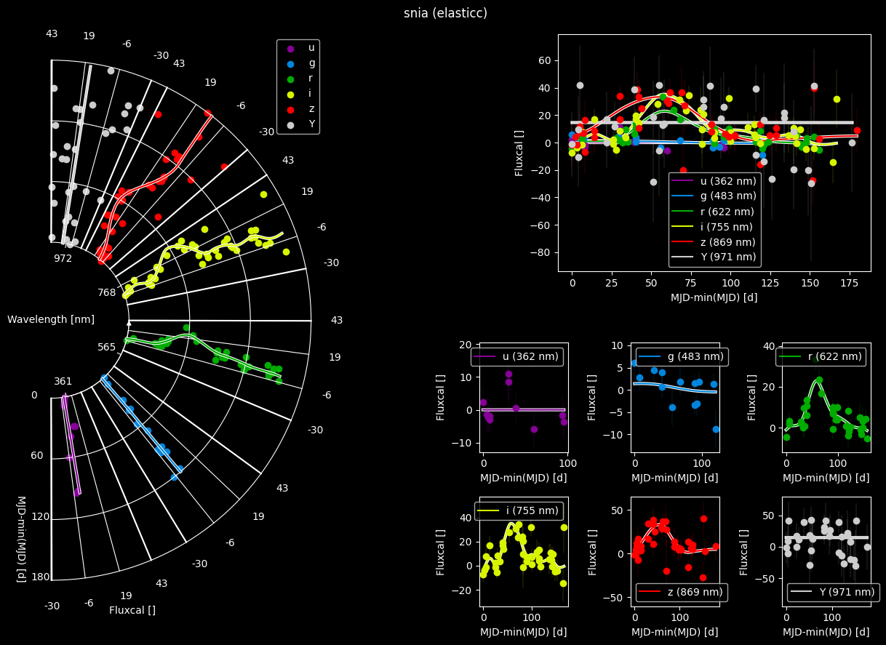
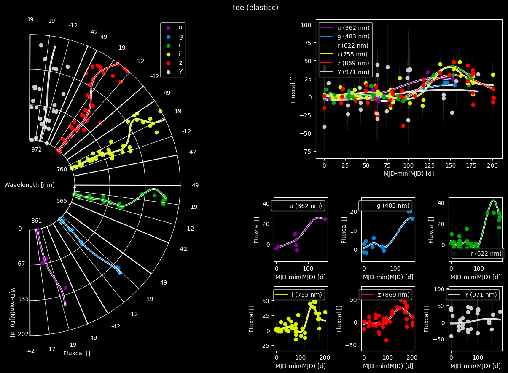
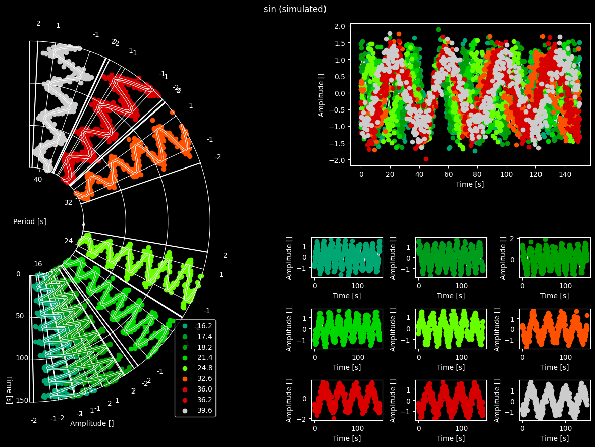

# LStein: Linking Series to envision information neatly

> [!WARNING]
> Note, that this package is currently under development.
> Most functionalities should work, but changes will be implemented on a running basis and without notice.
> No test have been performed yet.

## Installation
You can easily install the package using [`pip`](https://pypi.org/project/pip/):

```shell
pip3 install git+https://github.com/TheRedElement/LStein.git
```

## Try It Yourself
A jupyter notebook with a minimal working example (and options to use your own data) can be found in [LStein_demo_colab.ipynb](./LStein_demo/LStein_demo_colab.ipynb).
[](https://colab.research.google.com/github/TheRedElement/LStein/blob/main/LStein_demo/LStein_demo_colab.ipynb) to try it out without local installations.

## Reference
If you use this code in your work please use this entry in your bibliography (for now):

```latex
@software{PY_Steinwender2020_lstein,
	author    = {{Steinwender}, Lukas},
	title     = {LStein: Linking Series to envision information neatly},
	month     = Jul,
	year      = 2025,
	version   = {latest},
	url       = {https://github.com/TheRedElement/LStein.git}
}
```

## Data For Testing
Data used for [demos](./LStein_demo/LStein_demo.ipynb) and [testing](./LStein_tests/) can be found in [data/](./data/).
Each dataset is a `.csv` file with the following columns:

| Column | Description |
| :- | :- |
$\theta$-values | values to be plotted as azimuthal offset of the panel
$x$-values      | values to be plotted radially
$y$-values      | values to be plotted as an azimuthal offset constraint to a circle-sector
$y$-errors      | errors assigned to $y$-values
`processing context`  | which processing was used

The demo will behave as follows:
1. take the first 3 columns (in order) as $\theta$-, $x$-, $y$-values
2. take the column names as axis-labels
3. plot a scatter for `processing context="raw"`
4. plot a line for `processing context!="raw"`

You can try your own data as well, but make sure to
1. follow the above-mentioned conventions
2. deposit your file in [data/](./data/)
3. add at least one row with `processing context!="raw"`
    1. if you just have raw data, you can always just duplicate the rows and change half of the rows to `processing context!="raw"`

## Advantages and Downsides

Pros:
+ no overcrowded panels
+ similar $\theta$-values (i.e., passbands) are plotted closer together
+ allows to preserve amplitude-differences across $\theta$-values for same $y$-values
+ allows to depict arbitrary number of $\theta$-values (by means of reducing the angular size of each $\theta$-panel) 
+ works for people with color-blindness due to relational display of information
+ can be applied to variety of data (not only lightcurves)
	+ examples: spectra over time, different machine learning models
+ layout entirely customizable

Cons:
- projection effects close to `xmin`
- does currently *not* support plotting errorbars
	- workaround: plot another line if you want to indicate uncertainties


## Example Figures

|||
|:-|:-|
<a name=fig-lsteinsnia></a>
|||
|Example for visualizing an [ELAsTICC](https://portal.nersc.gov/cfs/lsst/DESC_TD_PUBLIC/ELASTICC/) SN Ia. I compare LStein on the left to traditional displays on the right. | Example for visualizing an [ELAsTICC](https://portal.nersc.gov/cfs/lsst/DESC_TD_PUBLIC/ELASTICC/) TDE. I compare LStein on the left to traditional displays on the right. |
|||
|Example for visualizing an [ELAsTICC](https://portal.nersc.gov/cfs/lsst/DESC_TD_PUBLIC/ELASTICC/) SN II. I compare LStein on the left to traditional displays on the right. | Example for visualizing a set of artificially simulated sine waves. I compare LStein on the left to traditional displays on the right. |


## TODO
* [testing](./LStein_tests/)

## Known Bugs
* `y_projection_method="theta"` goes haywire for huge x-values (for sure $\ge10000$)
    * the reason is the necessity to compute $\tan$ and $arc\tan$ when converting back and forth between coordinate systems
    * workarounds
        * formulate your series relative to some value so you remain in a reasonable range
        * use `y_projection_method="y"`
