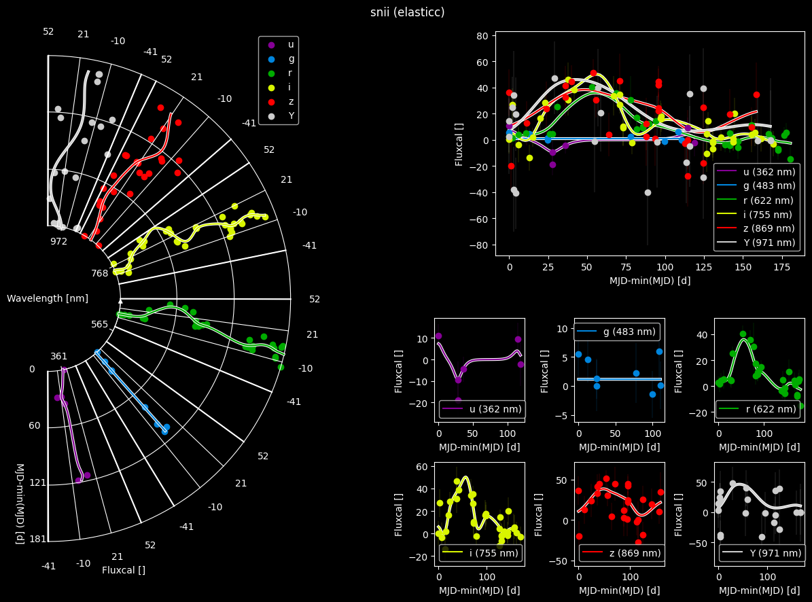

# WELCOME


<!-- :hidden: so it's just in navigation -->
```{toctree}
:glob:
:maxdepth: 2
:hidden:

pages/*
```

<!-- local table of contents -->
```{contents} Table of Contents
:local:
:depth: 3
```

```{include} _static/quickstart.ipynb
```


> [!WARNING]
> Note, that this package is currently under development.
> Most functionalities should work, but changes will be implemented on a running basis and without notice.
> No tests have been performed yet.

> [!INFO]
> This page summarizes the most common characteristics, pitfalls etc.
> Please refer to the paper for a more detailed list and [Tutorials](pages/tutorals.rst) for solutions to some known issues/missing features.

## Reference
If you use this code in your work please use this entry in your bibliography (for now):

```latex
@software{PY_Steinwender2025_lstein,
	author    = {{Steinwender}, Lukas},
	title     = {LStein: Linking Series to envision information neatly},
	month     = Jul,
	year      = 2025,
	version   = {latest},
	url       = {https://github.com/TheRedElement/LStein.git}
}
```


## Installation
You can easily install the package using [pip](https://pypi.org/project/pip/):

```shell
pip3 install git+https://github.com/TheRedElement/LStein.git
```

## Quick Start
Data used for [Tutorials](pages/tutorals.rst) can be found in [data/](https://github.com/TheRedElement/LStein/blob/main/data/).
There are also a few other datasets so feel free to have a play around.
Each dataset is a `.csv` file with the following columns:

| Column | Description |
| :- | :- |
$\theta$-values | values to be plotted as azimuthal offset of the panel
$x$-values      | values to be plotted radially
$y$-values      | values to be plotted as an azimuthal offset constraint to a circle-sector
$y$-errors      | errors assigned to $y$-values
`processing context`  | which processing was used

The demo will behave as follows:
1. take the first 3 columns (in order) as $\theta$-, $x$-, $y$-values
2. take the column names as axis-labels
3. plot a scatter for `processing context="raw"`
4. plot a line for `processing context!="raw"`

You can try your own data as well, but make sure to
1. follow the above-mentioned conventions
2. add at least one row with `processing context!="raw"`
    1. if you just have raw data, you can always just duplicate the rows and change half of the rows to `processing context!="raw"`


## Example Plots
|||
|:-|:-|
<a name=fig-lsteinsnia></a>
|||
|Example for visualizing an [ELAsTICC](https://portal.nersc.gov/cfs/lsst/DESC_TD_PUBLIC/ELASTICC/) SN Ia. I compare `LStein` on the left to traditional displays on the right. | Example for visualizing an [ELAsTICC](https://portal.nersc.gov/cfs/lsst/DESC_TD_PUBLIC/ELASTICC/) TDE. I compare `LStein` on the left to traditional displays on the right. |
|||
|Example for visualizing an [ELAsTICC](https://portal.nersc.gov/cfs/lsst/DESC_TD_PUBLIC/ELASTICC/) SN II. I compare `LStein` on the left to traditional displays on the right. | Example for visualizing a set of artificially simulated sine waves. I compare `LStein` on the left to traditional displays on the right. |

## Advantages and Downsides

### Pros

+ no overcrowded panels
+ similar $\theta$-values (i.e., passbands) are plotted closer together
+ allows to preserve amplitude-differences across $\theta$-values for same $y$-values
+ allows to depict arbitrary number of $\theta$-values (by means of reducing the angular size of each $\theta$-panel) 
+ works for people with color-blindness due to relational display of information
+ can be applied to variety of data (not only lightcurves)
	+ examples: spectra over time, different machine learning models
+ layout entirely customizable

### Cons

- projection effects close to `xmin`
- does currently *not* support plotting errorbars
	- workaround: plot another line if you want to indicate uncertainties


## Known Bugs
* `y_projection_method="theta"` goes haywire for huge $x$-values (for sure $x\ge10000$)
    * the reason is the necessity to compute $\tan$ and $arc\tan$ when converting back and forth between coordinate systems
    * workarounds
        * formulate your series relative to some value so you remain in a reasonable range
        * use `y_projection_method="y"`